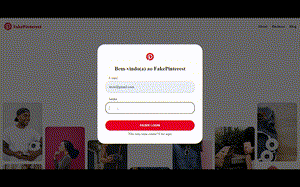

# 🌆 Fake Pinterest

### ✨ Sobre este projeto

Este projeto é uma  **simulação simplificada do Pinterest** , onde os usuários podem **criar uma conta, postar fotos** e  **acompanhar outros perfis** . O principal objetivo é explorar o desenvolvimento **backend utilizando Flask** e **SQLite** como banco de dados.

> 🔍 Observação: Este projeto é apenas uma réplica educacional e não tem fins comerciais.

📌**Acesse:** repositorio.com

📧**Login:** teste@gmail.com

🔑**Senha:** 123123

---

### 📊 Funcionalidades

- Cadastro de Usuário: Crie uma conta para acessar a plataforma.
- Login e Logout: Sessões seguras para cada usuário.
- Postagem de Fotos: Adicione suas imagens favoritas ao seu perfil.
- Feed Personalizado: Visualize postagens dos outros perfis.
- Acesso a Perfis: Explore os perfis de outros usuários e acompanhe seu conteúdo.

---

> Veja o site em execução 🐱‍💻

---

### 🚀 Ferramentas e Bibliotecas

Flask, Flask Wtf, Flask Bcrypt, Datetime, Werkzeug, SQLite e Pathlib

---

### 💌 Quer falar comigo?

Entre em contato:

  
  
  
  

---
