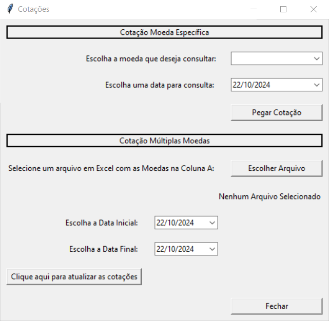
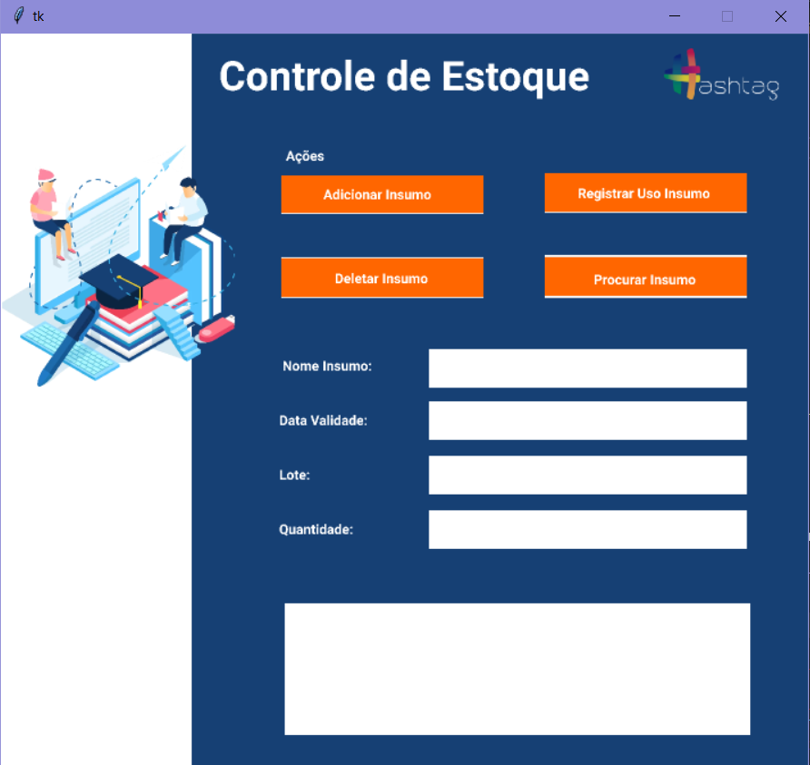

# 🖥️ Telas Tkinter

### ✨ Sobre este projeto

Este projeto tem como objetivo  **criar interfaces de sistemas usando Tkinter** , com dois exemplos práticos:

- **Cotação de moedas** por meio de uma API.
- **Controle de Estoque** utilizando operações CRUD em um banco de dados.

---

### 📊 Funcionalidades

**Cotação de Moedas:**

- **Pegar Cotação por Data:** Busca as cotações da moeda selecionada para uma data específica.
- **Múltiplas Cotações:** Importa moedas de uma planilha e salva um arquivo com os valores retornados dentro do período selecionado.

**Controle de Estoque Banco de Dados (CRUD):**

- **Procurar:** Procurar itens no banco de dados.
- **Deletar:** Remove insumos do banco de dados.
- **Cadastrar:** Adiciona novos insumos ao banco de dados.
- **Alteração:** Atualiza informações de insumos já cadastrados.

---

> Exemplo de tela de cotação. 🐱‍💻

---

> Exemplo de tela de controle de estoque. 🐱‍💻

---

### 🚀 Ferramentas e Bibliotecas

Tkinter, Tkcalendar, Xmltodict, Requests, Pandas, Pyodbc, Regex e Unidecode

---

### 💌 Quer falar comigo?

Entre em contato:

  
  
  
  

---
