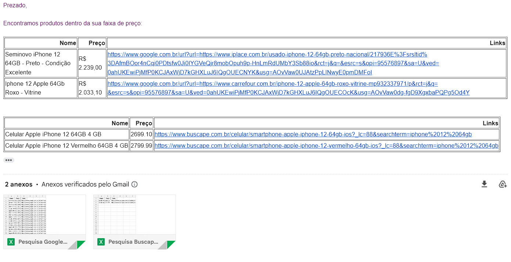

# 🛍️ Web Scraping de Produtos

### ✨ Sobre este projeto

Este projeto simula a necessidade de comparação entre fornecedores para insumos/produtos. O código faz a pesquisa no GoogleShop e Buscapé de produtos adicionados em uma planilha, realizando a pesquisa dos produtos pelo seu valor minímo e valor maximo, depois adicionando eles em uma planilha com um link para cada produto encontrado, por fim encaminha um email informando que o produto foi encontrado dentro do preço desejado, com a planilha de links em anexo.

---

### 📊 Funcionalidades

**Pesquisa de produtos:**

- Realiza pesquisa de preços no **Buscapé** com base nas faixas definidas na planilha.
- Faz buscas no **Google Shop** pelos mesmos critérios.
- Filtra produtos que contêm palavras banidas fornecidas pelo usuário (por exemplo: "mini", "watch", etc.)

**Automação de envio de emails :**

- Gera planilhas com links para os produtos encontrados.
- Envia emails automaticamente informando que os produtos foram localizados dentro da faixa de preço desejada.
- Salva a planilha no computador.

---

> O projeto faz a análise dos produtos e envia por email todas as ocorrências. 🐱‍💻

---

> Imagem do email enviado. 💌

---

### 🚀 Ferramentas e Bibliotecas

Pandas, Selenium e Yagmail

---

### 💌 Quer falar comigo?

Entre em contato:

  
  
  
  

---
