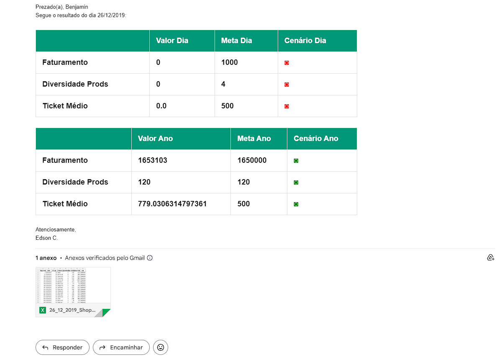

# Automação de Indicadores

### ✨ Sobre este projeto

Este projeto simula o processo de análise e envio automatizado de indicadores de uma grande rede fictícia com  **25 lojas espalhadas pelo Brasil** . A automação realiza a análise dos dados de vendas e envia OnePages personalizadas para cada gerente de loja, além de um resumo consolidado para a gerência geral.

> 🔍 Este projeto é apenas uma simulação e **todos dados e credenciais são fictícios.**

---

### 📊 Funcionalidades

**Indicadores de Desempenho:**

- Faturamento diário e anual.
- Variedade de produtos vendidos no último dia e no acumulado do ano.
- Cálculo do ticket médio diário e anual

**Automação de envio de emails :**

- Geração automática das OnePages personalizadas.
- Envio individual para cada gerente.
- Relatório consolidado para a gerência geral.

---

> O projeto executa o envio automatizado de **26 emails** em poucos minutos, com análises completas e indicadores atualizados. 🐱‍💻

---

> Imagem do email enviado. 💌

---

### 🚀 Ferramentas e Bibliotecas

Pandas, Pathlib, Yagmail e Pretty_html_table

---

### 💌 Quer falar comigo?

Entre em contato:

  
  
  

---
