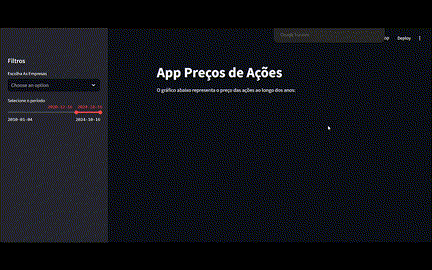

# 📈 Streamlit Dashboard Ações IBOVESPA

### ✨ Sobre este projeto

Este projeto tem como objetivo simular um **site interno para monitoramento de preços de ações** com dados obtidos em tempo real via  **Yahoo Finance** .
> 🔍 Este projeto é apenas para fins de estudo e não possui uso comercial.

**Acesse: ** [Acesse o Site](https://projeto-acoes.streamlit.app/)
---

### 📊 Funcionalidades

- ***Gráficos interativos:** Visualize as oscilações diárias dos ativos de 2010 até a data atual.*
- ***Filtros personalizados:** Filtre por **empresa e data** para análises específicas*
- **Performance em porcentagem:** Acompanhe a evolução dos ativos ao longo do tempo
- ***Simulação de carteira:** Visualize o desempenho de uma carteira fictícia de investimentos.*

---

> Aqui você pode ver o projeto em ação. 🐱‍💻

---

### 🚀 Ferramentas e Bibliotecas

Streamlit, Yahoo Finance API, Pandas e Datetime

---

### 💌 Quer falar comigo?

Entre em contato:

  
  
  
  

---
